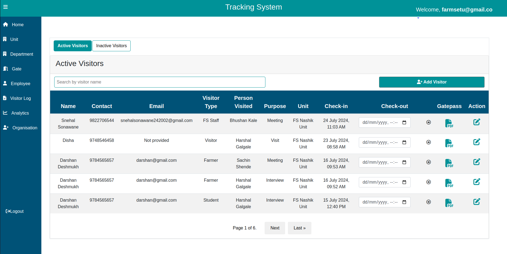
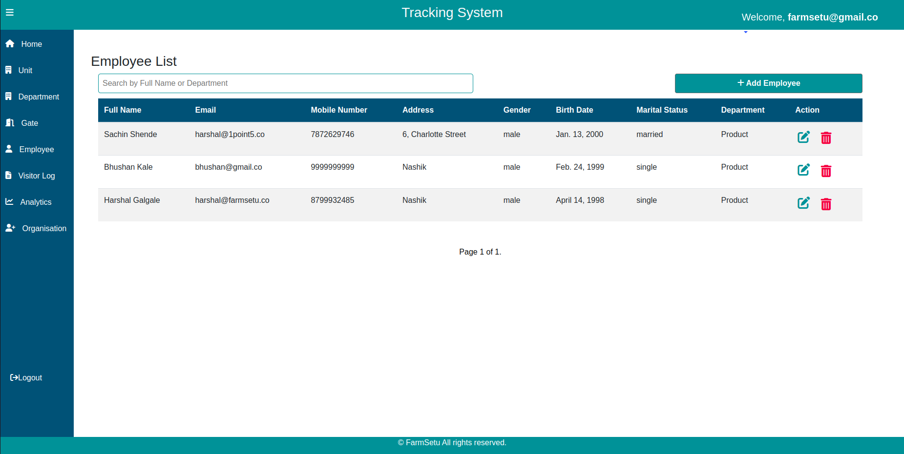

# README #

VMS-Snapshots







### To generate dummy data ###
* python manage.py generate_data


### To configure the Hasura ###

## Overview

This project uses Hasura to provide instant GraphQL APIs for our PostgreSQL database. Hasura simplifies data access and management, offering features like real-time subscriptions, role-based access control, and seamless integration with custom business logic.

## Features

- **GraphQL API**: Automatically generated GraphQL schema based on the PostgreSQL database schema.
- **Real-time Subscriptions**: Real-time updates for queries via GraphQL subscriptions.
- **Authentication & Authorization**: Built-in support for JWT and role-based access control.
- **Event Triggers**: Invoke webhooks or serverless functions on database events.
- **Remote Schemas**: Integrate remote GraphQL schemas with the Hasura schema.
- **Migrations**: Manage database schema and track changes with migrations.

## Getting Started

## Prerequisites

- Docker
- PostgreSQL
- Node.js and npm (for Hasura CLI)

### setup 
### settings.py
```
DATABASES = {
    "default": {
        'ENGINE': 'django.db.backends.postgresql_psycopg2',
        'HOST': os.environ.get('POSTGRES_HOST', '127.0.0.1'),
        'PORT': os.environ.get('POSTGRES_PORT', 5432),
        'NAME': os.environ.get('POSTGRES_DB', 'visitor_db'),
        'USER': os.environ.get('POSTGRES_USER', 'visitor_admin'),
        'PASSWORD': os.environ.get('POSTGRES_PASSWORD', 'admin123'),

    
    }
}
```

## docker-compose.yaml
```
version: "3"

services:
  db:
    image: mdillon/postgis
    container_name: visitor_database
    ports:
      - "5432:5432"
    volumes:
      - visitor_db:/var/lib/postgresql/data
    environment:
      - POSTGRES_HOST=db
      - POSTGRES_PORT=5432
      - POSTGRES_DB=visitor_db
      - POSTGRES_USER=visitor_admin
      - POSTGRES_PASSWORD=admin123
    networks:
      - db_network

  graphql-engine:
    image: hasura/graphql-engine:v2.38.0
    ports:
      - "8080:8080"
    depends_on:
      - "db"
    environment:
      HASURA_GRAPHQL_DATABASE_URL: postgres://visitor_admin:admin123@db:5432/visitor_db
      ## enable the console served by server
      HASURA_GRAPHQL_ENABLE_CONSOLE: "true" # set to "false" to disable console
      ## enable debugging mode. It is recommended to disable this in production
      HASURA_GRAPHQL_DEV_MODE: "true"
      HASURA_GRAPHQL_ENABLED_LOG_TYPES: startup, http-log, webhook-log, websocket-log, query-log
      ## uncomment next line to set an admin secret
      HASURA_GRAPHQL_ADMIN_SECRET: visitor_db
      HASURA_GRAPHQL_JWT_SECRET: '{"type":"HS256","key":"F8fmcyKmgcm8lZSIZoCbxCTPCW21Ej0C","claims_namespace":"user_claims","claims_format":"json"}'
    restart: always
    networks:
      - db_network

  graphql-data-connector:
    image: hasura/graphql-data-connector:v2.38.0
    container_name: data-connector-agent-1
    ports:
      - "8081:8081"
    depends_on:
      - db
    networks:
      - db_network
      
networks:
  db_network:
    driver: bridge

volumes:
  visitor_db:
```

### Run the following command to start the services:
- docker-compose up -d

### Set Up Hasura CLI
- npm install -g Hasura-cli

### Initialize Hasura Project
- hasura init vms-hasura --endpoint http://localhost:8080 --admin-secret visitor_db

### Apply Migrations and Metadata
- cd vms-hasura
- hasura migrate apply --endpoint http://localhost:8080 --admin-secret visitor_db
- hasura metadata apply --endpoint http://localhost:8080 --admin-secret visitor_db

### Start Hasura Console
- hasura console --endpoint http://localhost:8080 --admin-secret visitor_db
